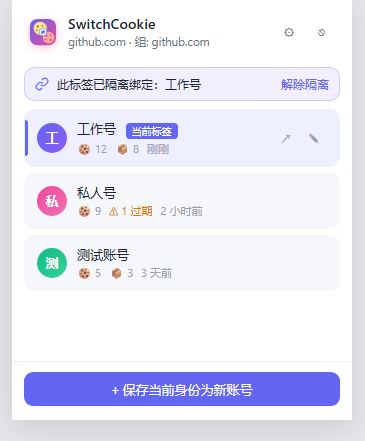
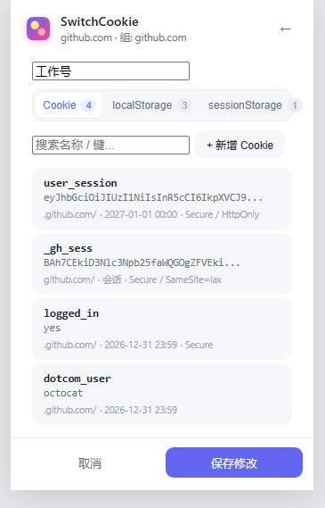

# SwitchCookie · 浏览器账号切换器（每标签隔离版）

Chrome / Edge (Manifest V3) 扩展。**同一个域名可以在多个标签页里各自登录不同账号**，
Cookie 与 localStorage 均按标签隔离，互不干扰。数据本地存储，可选主密码加密。

## ✨ 功能

- **每标签隔离**（Cookie + localStorage）：绑定后，该标签的所有 HTTP 请求会被改写成使用绑定账号的 Cookie；页面 JS 读写 `localStorage` 走的是该标签的私有存储，不会互相覆盖。
- **在新标签中打开**：卡片上的↗按钮会新开一个标签并绑定好账号后再加载目标 URL。
- **完整快照**：Cookie（含 HttpOnly）、localStorage、sessionStorage 一次打包。
- **Set-Cookie 吸收**：服务器下发的新 Cookie 自动进入该标签的私有 jar，并从全局 jar 中清理。
- **主密码保护**：AES-GCM + PBKDF2 加密整个快照库。
- **编辑账号快照**：直接在插件里增删改 Cookie（含 Domain / Path / 过期时间 / Secure / HttpOnly / SameSite）以及 localStorage / sessionStorage 键值；正在被其他标签绑定的账号会即时同步。
- **精准域名归组**：内置 Public Suffix List。

## 兼容浏览器

| 浏览器 | 支持情况 | 说明 |
|--------|---------|------|
| Chrome | ✅ 完整支持 | Chromium 内核 |
| Edge | ✅ 完整支持 | 基于 Chromium，功能一致 |
| Firefox | ❌ 不支持 | MV3 实现差异大（DNR `tabIds`/`modifyHeaders` 行为不同） |
| Safari | ❌ 不支持 | 不支持 Manifest V3 |

需浏览器支持 `chrome.storage.session` 与 DNR `tabIds` 条件匹配（均为较新 Chromium 特性）。

## 🚀 安装

### A. 通过 Release Zip 安装（推荐给一般用户）

1. 打开本项目 **Releases**（或 Actions Workflow 里的 `Build extension zip` 产物）。
2. 下载最新的 `SwitchCookie-vX.Y.Z.zip` 并解压到一个稳定的目录（**不要**解压后删掉该目录，浏览器会持续引用它）。
3. `chrome://extensions` → 打开右上角 **开发者模式** → 点 **加载已解压的扩展程序** → 选择上一步解压出来的文件夹。

### B. 从源码加载（开发者）

1. 克隆本仓库到本地。
2. `chrome://extensions` → 打开右上角 **开发者模式**。
3. **加载已解压的扩展程序** → 选择本项目根目录。
4. 修改代码后，在扩展管理页点击 🔄 刷新按钮即可。

> 出于安全原因，Chrome 已不再支持直接双击 `.crx` 安装第三方扩展，因此我们仅提供解压后加载这种方式。

## 🧭 使用

1. 正常登录 A 账号 → 打开插件 → **保存当前身份为新账号**（例如"账号 A"）。
2. 登出后再登录 B 账号 → 保存为"账号 B"。
3. **两标签同时用两个账号**：
   - 卡片右侧点↗ 在新标签以此账号打开；或
   - 新开空白标签导航到网站 → 打开插件点账号卡片进行绑定。
4. 绑定后顶部会显示"此标签已隔离绑定：xxx"，点"解除隔离"可回到全局模式。

## 界面预览

<p align="center">
  
  &nbsp;&nbsp;
  
</p>

| 左 | 右 |
|----|----|
| 账号列表 · 当前标签隔离绑定提示条 · 一键新标签打开 | Cookie / localStorage / sessionStorage 编辑器 |

## 权限说明

| 权限 | 用途 |
|------|------|
| `cookies` | 读取/移除全局 Cookie（擦除隔离标签的 Set-Cookie 泄漏） |
| `storage` | 本地存储账号快照 + session 存储绑定状态 |
| `tabs` | 查询当前标签信息、新标签打开 |
| `scripting` | 注入脚本读取 localStorage/sessionStorage |
| `webRequest` | 拦截 Set-Cookie 响应头 |
| `declarativeNetRequest` | 按标签改写 Cookie 请求头 |
| `declarativeNetRequestWithHostAccess` | 允许对所有域生效 |
| `host_permissions <all_urls>` | 操作所有站点的 Cookie |

## 🔐 安全与隐私

- **数据全本地**：所有账号快照仅存储在浏览器本地，不上传任何数据。
- **主密码加密**：PBKDF2-SHA256(250000 次迭代) 派生密钥，AES-GCM-256 加密存储。
  - 加密后的密文存储在 `chrome.storage.local`，密钥仅存在于 SW 内存中。
  - Service Worker 被浏览器回收后自动进入锁定状态，需重新输入主密码。
- **无网络请求**：扩展本身不发起任何外部网络请求。

## ⚠️ 已知边界

| 场景 | 表现 | 原因 |
| --- | --- | --- |
| 站点用 Service Worker / Web Worker 中转登录请求 | 部分请求仍走全局身份 | SW fetch `tabId = -1`，DNR 无法按标签匹配 |
| 站点用 IndexedDB / Cache Storage 存登录态 | 多个隔离标签会看到同一份 | 浏览器按 origin 共享，扩展无法在不刷新前提下劫持 |
| 页面 JS 用 `document.cookie` **读** cookie | 读到的是浏览器全局 jar | 读路径无法被扩展覆盖（**写**已拦截进虚拟 jar） |
| 页面用 iframe 沙箱或 `Object.freeze(window)` 冻结 storage 描述符 | 该 frame 内 storage 隔离失效 | defineProperty 会静默失败 |
| 未列入相关域组的跨站 SSO | 第三方登录域 Cookie 可能采不全 | 已内置 Google/Microsoft/GitHub 等常见组，其它站仅覆盖当前 eTLD+1 |
| CHIPS 分区 Cookie（Partitioned） | 可能无法完整还原 | 浏览器分区键扩展层无法完全模拟 |

**适用**：依赖 Cookie + localStorage/sessionStorage 的传统 Web / 多数 CMS / SPA。  
**慎用**：IndexedDB / Service Worker 重度登录态站点 — 建议同时只开一个隔离标签。

**已覆盖的增强**（v0.1.2+）：

- `document.cookie` 写入 → 虚拟 jar  
- sessionStorage 完整隔离与持久化  
- 保存时按 eTLD+1 + 子域 + 相关 SSO 域采集 Cookie  
- 绑定期间 Set-Cookie / storage 变更自动回写账号快照  
- DNR 对相关域组一并改写 Cookie 头  

## 存储架构

```
┌─ chrome.storage.local ─────────────────────┐
│  sc:meta      → { encrypted, salt }         │  持久化（磁盘）
│  sc:cipher    → { iv, ct }（加密后密文）     │
│  sc:plain     → { accounts, active }（明文） │
├─ chrome.storage.session ────────────────────┤
│  sc:session:bindings → tabId → 绑定映射      │  浏览器会话级（SW 重启不丢）
│  sc:session:jars      → tabId → Cookie jar   │
│  sc:session:local     → tabId → localStorage │
│  sc:session:session   → tabId → sessionStorage│
├─ Service Worker 内存 ───────────────────────┤
│  tabBindings / tabJars / tabLocalStore       │  当前会话热数据
│  tabSessionStore / unlockedKey               │
└─────────────────────────────────────────────┘
```

## 🛠 开发

### 调试技巧

- **Background SW**：在扩展管理页点背景页面 → **Service Worker** 的 **inspect** 打开 DevTools。
- **Content Scripts**：在普通网页的 DevTools → **Console** 中查看日志（`sc:*` 前缀）。
- **Popup**：右键弹出窗 → **审查元素**。
- **DNR 规则**：`chrome://net-export` 或 DevTools → Network 查看请求头修改情况。
- 修改代码后刷新扩展（扩展管理页 🔄）即可，无需构建。

### 更新 PSL 列表

```bash
# 从 publicsuffix.org 下载最新列表
curl -O https://publicsuffix.org/list/public_suffix_list.dat
# 运行生成脚本（需 Python，见 _gen_icons.py 同级）
python _gen_psl.py
```

> 当前 `lib/psl.js` 是自动生成的，不要手动编辑。

### AI 辅助开发

`AGENTS.md` 包含 agent 需要的架构约束和约定，参见该文件。

## 🛠 技术要点

- **DNR session rules**：`chrome.declarativeNetRequest.updateSessionRules({ tabIds, requestDomains })` 按标签改写 `Cookie` 请求头。
- **webRequest.onHeadersReceived (extraHeaders)**：观测响应中的 `Set-Cookie`，合并进标签私有 jar，同时清理全局 jar。
- **content_scripts (MAIN world, document_start)**：`shadow.js` 用 `Object.defineProperty(window, "localStorage", ...)` 装一层 Proxy；ISOLATED world 的 `bridge.js` 通过 `CustomEvent` 与 MAIN world 通信、和 background 收发绑定状态和存储更新。
- **Web Crypto**：`PBKDF2-SHA256(250000) → AES-GCM(256)`。
- **SW 生命周期**：绑定状态持久化到 `chrome.storage.session`，SW 重启后自动恢复 DNR 规则和 Cookie jar。

## 📁 目录结构

```
SwitchCookie/
├─ manifest.json
├─ background.js          # DNR + webRequest + tab 状态机 + 会话持久化
├─ AGENTS.md              # AI agent 指令文件
├─ content/
│  ├─ shadow.js           # MAIN world: localStorage Proxy
│  └─ bridge.js           # ISOLATED world: 绑定同步 + 变更回传
├─ lib/
│  ├─ psl.js              # Public Suffix List（自动生成）
│  └─ crypto.js           # PBKDF2 + AES-GCM 加密
├─ popup/
│  ├─ popup.html
│  ├─ popup.css
│  └─ popup.js
└─ icons/
```

## 📝 License

MIT
